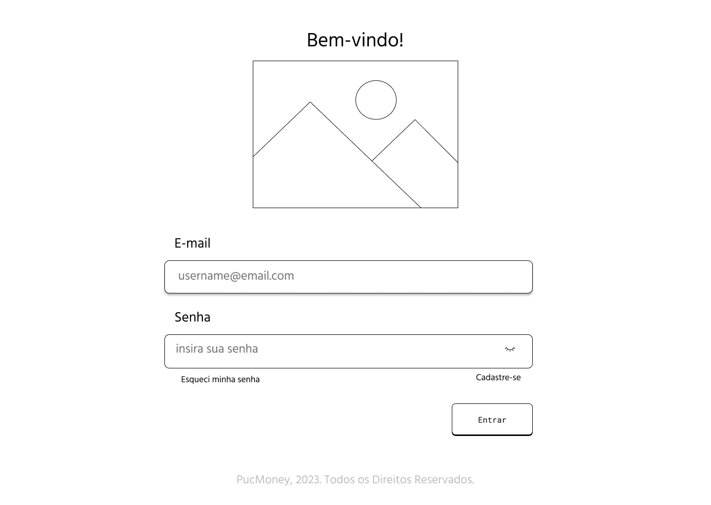
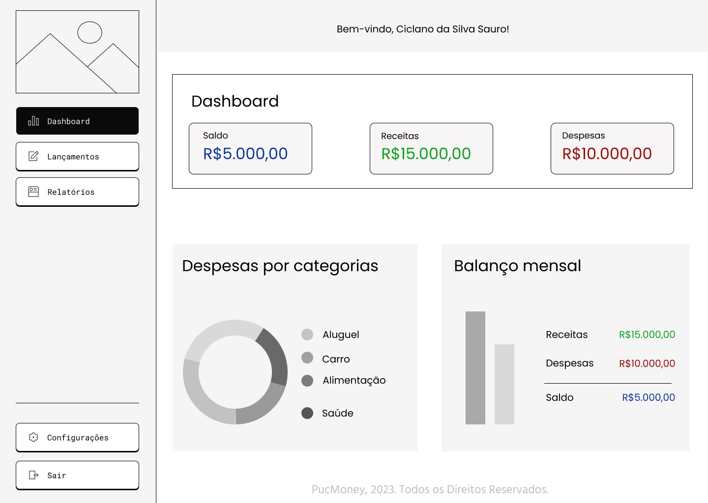
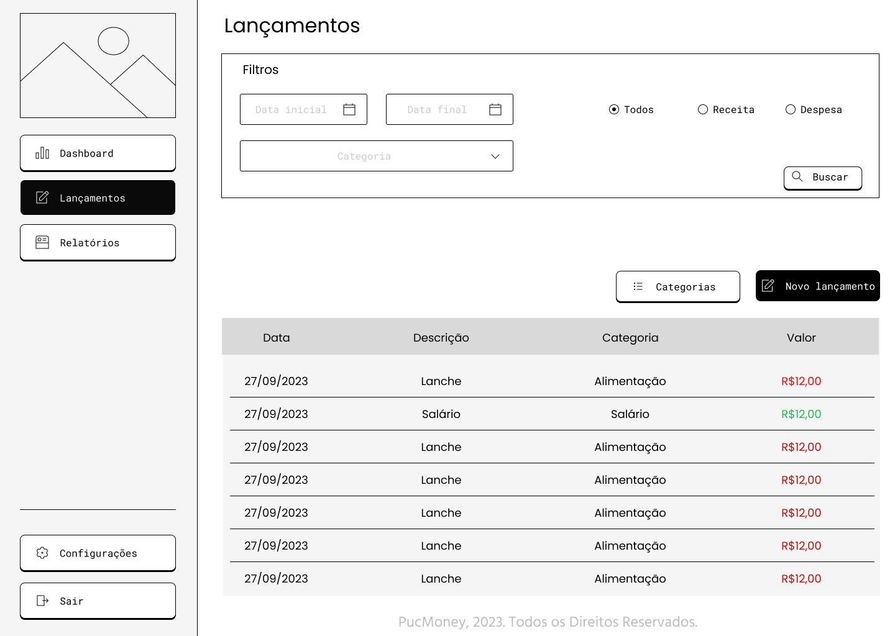
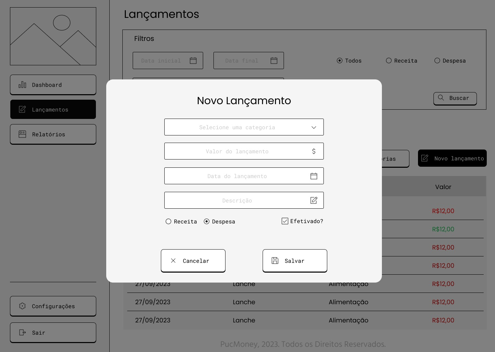
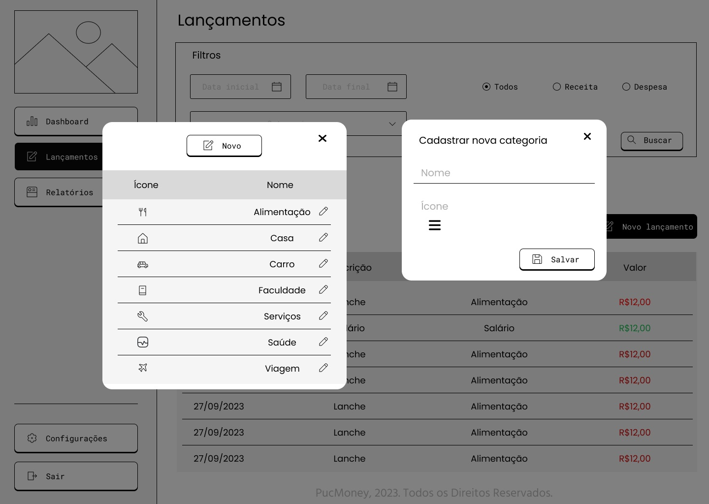
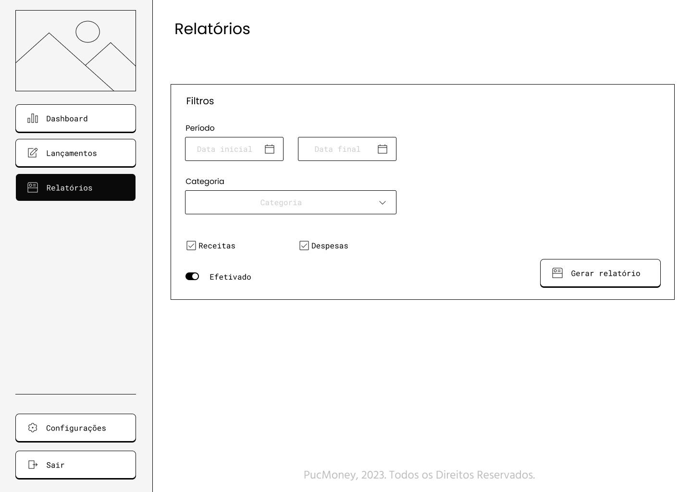
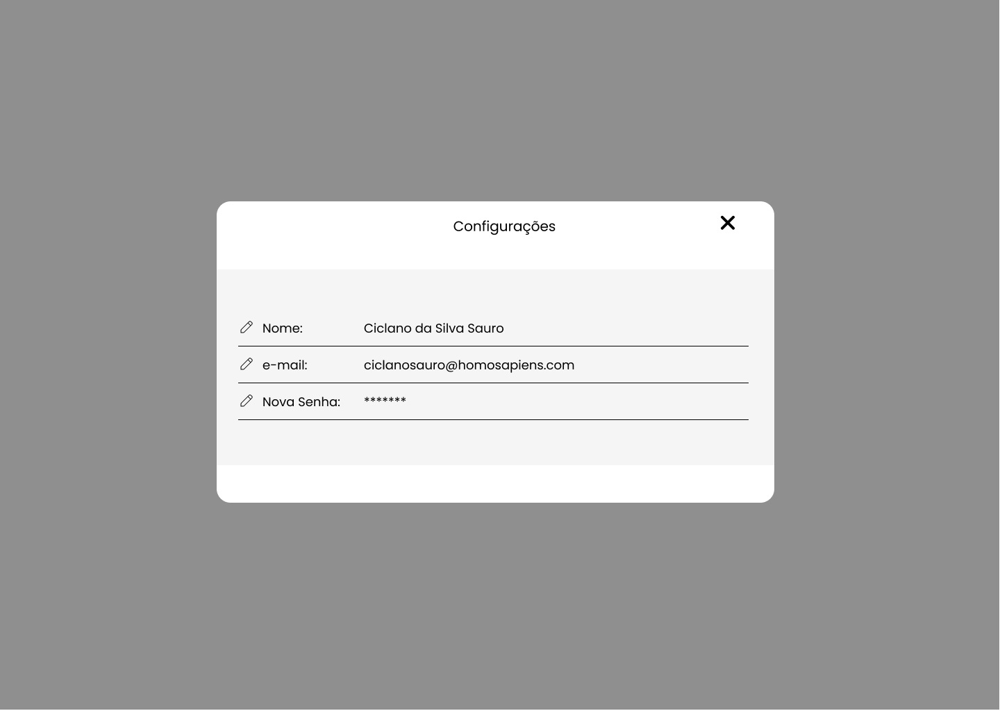
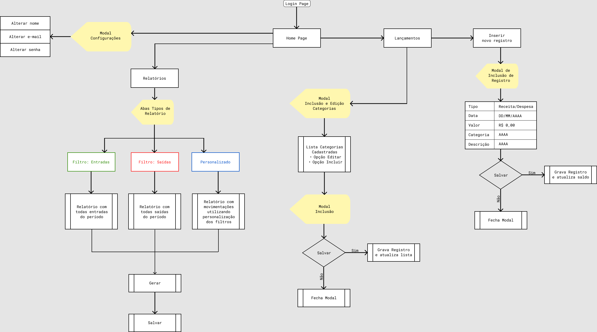

# Projeto de Interface

> Tela de Login para entrada no sistema PucMoney.
> 

> Dashboard sendo a página Home do sistema, por ela temos uma prévia da situação financeira do usuário.
> 

> Tela de preparação para inclusão de lançamentos o usuário possui acesso também as últimas inclusões.
> 

> Modal de inclusão de novos lançamentos.
> 

> Modal para criar e editar categorias.
> 

> Tela para relatórios diversos da movimentação financeira do usuário.
> 

> Modal para alteração de dados do usuário.
> 

## User Flow

## Protótipo baixa fidelidade
